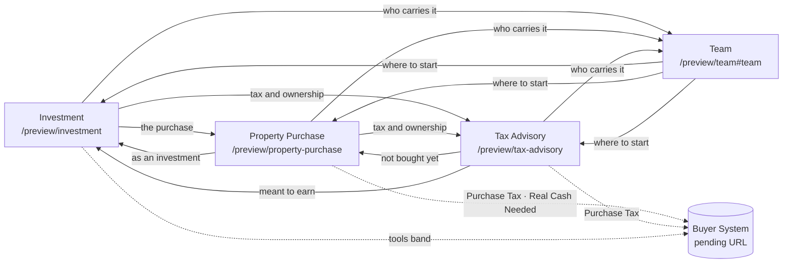

# Phase 2G — Connected service journey

**Status:** PREVIEW — implemented on `feat/phase-2g-connected-service-journey`, pending Juanma's human visual review. Not approved for production.
**Date:** 2026-09-24
**Base:** `main` at `2a200ed` (merge of PR #28)
**Scope:** `/preview/investment`, `/preview/property-purchase`, `/preview/tax-advisory`, `/preview/team`. `app/page.tsx` (Foundation) is untouched.

All four routes stay under `/preview`: `laboratory: true`, `noindex, nofollow`, out of the sitemap.

---

## 1. What changed, in one paragraph

The four landings now read as one advisory route (opportunity → purchase → tax and ownership), with the team as the layer of named responsibility across all three. One shared band (`ServiceJourney`) closes each landing's own journey chain with _where to go next from here, and why_; Property Purchase gains the owner's brand film in a "Good idea, bad execution" band; Tax Advisory gains the Purchase Tax entry point after its calendar, through the same Buyer System ribbon Property Purchase already used. The headers keep their in-page anchor navigation: nothing was added to them.

---

## 2. Video decisions

### 2.1 `BUENA IDEA_MALA EJECUCIÓN` — integrated in Property Purchase

**Analysis** (original, not the derivative):

| Property        | Value                                                                        |
| --------------- | ---------------------------------------------------------------------------- |
| Source          | `Juanmaes83/sarahkaterina` · `VIDEOS DE MARCA/BUENA IDEA_MALA EJECUCIÓN.mp4` |
| Git blob        | `31312fba73e924ac8a27891f676c0527b9e4d9de` (matches the brief)               |
| SHA-256         | `24b0e14b8ae9b19cbb6f02c7c39fd74faed7b7d4d4e5fd4f6fa334a0732a273e`           |
| Size            | 11,965,405 bytes                                                             |
| Video           | H.264 High, 1280×720 (16:9), 24 fps, yuv420p, 10.08 s                        |
| Audio           | AAC stereo 32 kHz, English voice-over plus bed                               |
| Text in footage | **None** — no titles, captions, logo or tagline in any frame                 |
| Cuts            | 1.75 s, 4.38 s, 5.71 s, 7.38 s, 8.71 s                                       |

**Sequence:** (0–1.7 s) muddy boots leave a grey, rainy home → (1.7–4.4 s) a woman, from behind, takes out her phone and makes a call → (4.4–5.7 s) an airliner over the coast at sunset → (5.7–7.4 s) aerial of Alicante with Santa Bárbara castle → (7.4–8.7 s) a blonde woman in a black suit (the same generated look used for Sarah in the approved Property Purchase hero) hands keys to the buyer in a bright room above the sea → (8.7–10.1 s) bare feet walk into the shallow sea.

**Voice-over** (local ASR transcript, `faster-whisper small`; `unverified` until a human listens): _"Sometimes changing your life starts with one call, then the horizon changes. Alicante, with the right person beside you the dream becomes a decision, and one day winter feels very far away."_ It contains no figure, promise, regulated claim or held subject.

**Findings that matter:**

1. **The film does not show a bad execution.** Despite its file name it shows the idea going well: the call, the flight, the keys. It cannot by itself say that a good opportunity can become a bad purchase. Resolution: the argument is carried by the HTML around it (title, lead, four failure points). The film is used for what it actually is — the idea, compressed into ten seconds — and the band says what the film leaves out. Nothing is hidden or overstated about the footage.
2. **Generated footage.** People are editorial participants, not clients; the generation method and rights record are not in either repository. Stated in the registry note and on the page caption.
3. **Keys handover.** Echoes the key-handover image the Property Purchase hero used before Phase 2F. It is not a hero here, and nothing names the other person a buyer or client.
4. **Voice-over not published.** The web derivatives are silent, like every clip in the registry; the band does not depend on sound. Publishing the voice-over would need Sarah's approval of the line, captions (WebVTT) and a sound-on control — see §9.
5. No quality defect blocks Preview use: no text to misspell, no visible artefacts at 720p, no brand marks on the aircraft at legible size.

**Placement:** Property Purchase, new `GoodIdeaBand`, **between `AudienceBand` and `OneFileBand`**.

- Why there: the template grammar puts "problem and objections" right after trust and audience. The band states the problem (a good idea can still become a bad purchase, and where), and the very next band, _One file_, is the answer. It prepares the next step by position, without a competing CTA.
- Why not near the hero: the hero is Sarah at the table (scroll-scrubbed). The film is a different moment — the buyer's own story — and a play-once treatment, two and a half screens further down.
- Why not near Worries / Before you sign: those bands already carry the risk checklist and the decision; the film there would repeat them rather than set them up.
- Contextual link: the _Tax_ failure point links to Tax Advisory ("How tax advisory fits in").

**Behaviour** (`components/motion/PlayOnceVideo.tsx`, new primitive):

- `preload="none"`; fetched one viewport ahead; plays once, muted, at the reading line; rests on its last frame; never loops; no `autoplay` attribute.
- Visible Play / Pause / Replay control (WCAG 2.2.2), keyboard reachable, labelled "Play/Pause/Replay the film".
- Reduced motion: nothing loads or plays; the final-frame poster shows; the control offers playback.
- No JavaScript: the poster (with alt text) shows; no control is rendered.
- Media failure: the poster stays, the control is retired (`data-film="failed"`).
- Slow network: the poster shows until the first frame decodes; the frame's ratio is fixed in the server markup, so nothing shifts.
- Tab hidden: paused; resumes on return.
- The `<video>` is `aria-hidden`; the poster's alt text describes the film; the HTML carries the meaning.

**Files:**

| File                                                | Role                                        | Size         |
| --------------------------------------------------- | ------------------------------------------- | ------------ |
| `VIDEOS/BUENA IDEA_MALA EJECUCIÓN.mp4`              | Untouched traceable copy (blob `31312fba…`) | 11,965,405 B |
| `public/media/video/purchase-good-idea.webm`        | VP9, 1280×720, silent, 2-pass ~0.7 Mbit/s   | 884,591 B    |
| `public/media/video/purchase-good-idea.mp4`         | H.264 High, 1280×720, silent, `+faststart`  | 930,339 B    |
| `public/media/video/purchase-good-idea-poster.webp` | Final frame (10.0 s), 1280×720              | 45,598 B     |

Registered as `APPROVED_VIDEO.purchaseGoodIdea` in `lib/media/approved-video.ts` (the existing video registry — no parallel system). Both derivatives respect the registry's 1 MB web budget and silent-derivative rule.

### 2.2 `TU INVERSIÓN MI OBJETIVO` — reserved for the future commercial Home

**Analysis:**

| Property        | Value                                                                                                |
| --------------- | ---------------------------------------------------------------------------------------------------- |
| Source          | `Juanmaes83/sarahkaterina` · `VIDEOS DE MARCA/TU INVERSIÓN MI OBJETIVO.mp4`                          |
| Git blob        | `a7cf919f149eb4d5f91c7ed50b9c413b2e22eaa6` (matches the brief)                                       |
| SHA-256         | `60bc8287cc76cbb3e321f8778c2427bf5ed4b366df270fb2dceafeeccf2a77c0`                                   |
| Size            | 7,571,748 bytes                                                                                      |
| Video           | H.264 High, 864×496 (≈16:9), 24 fps, 10.05 s                                                         |
| Audio           | AAC stereo 44.1 kHz — ambient/music only; no speech (ASR returned only its known no-speech artefact) |
| Text in footage | None                                                                                                 |

**Sequence:** Sarah's generated likeness on a bare coastal plot at dusk, reading a tablet → close-up of an architectural plan on the tablet → a white wireframe of the house rises over the plot → the wireframe resolves into a finished, lit white villa with an infinity pool above the sea.

**Decision: not integrated. Reserved for the future Home.** Not copied into `VIDEOS/` or `public/`, because no page uses it in this phase.

| Criterion               | Investment, before the final CTA                                                                                                                                                                                      | Future Home                                                                                               |
| ----------------------- | --------------------------------------------------------------------------------------------------------------------------------------------------------------------------------------------------------------------- | --------------------------------------------------------------------------------------------------------- |
| Duplication             | Its final 4 s — a lit white villa, pool, sea at dusk — repeat the Investment hero film (white hillside villas, pools, evening light). The Investment page would open and close on the same image.                     | No service hero to repeat.                                                                                |
| Narrative               | "Plot → finished villa" is one asset type (land / redevelopment), already covered by the territory map film and the land-development case.                                                                            | "Your investment, my objective" is Sarah's commitment across all three services: a brand manifesto.       |
| Conversion / governance | Next to "Request an analysis", a plot that becomes a finished villa reads as a buildability, timing or outcome promise. The team content explicitly says "No buildability, permission, timing or budget is promised." | Framed as the brand's point of view, followed by the three service doors, it routes rather than promises. |
| Hierarchy               | A third video on Investment (hero, map, this) before the CTA competes with the action.                                                                                                                                | One film after the trust strip, then the doors.                                                           |
| Performance             | +1 video request on the heaviest landing.                                                                                                                                                                             | Budgeted on its own page.                                                                                 |

A proposal composition is in `docs/screenshots/phase-2g/home-proposal/` (desktop and mobile) with a contact sheet of the film. It requires: an approved Home route and brief, an approved headline, confirmation that the generated likeness may represent Sarah, and a generation/rights record.

---

## 3. Connection map

| From              | To                                            | Where on the page                                                                          | Why (the reason shown to the reader)                                                |
| ----------------- | --------------------------------------------- | ------------------------------------------------------------------------------------------ | ----------------------------------------------------------------------------------- |
| Investment        | Property Purchase                             | `ServiceJourney`, after the journey chain                                                  | When the numbers hold, the risk moves into the file.                                |
| Investment        | Tax Advisory                                  | same                                                                                       | Purchase tax and owner obligations belong inside the analysis.                      |
| Investment        | Team                                          | same, team layer                                                                           | Who carries each part.                                                              |
| Investment        | Buyer System tools                            | existing `ToolsBand` (unchanged)                                                           | Purchase tax, real cash needed; Asking Price shown pending.                         |
| Property Purchase | Tax Advisory                                  | `GoodIdeaBand` · _Tax_ point; `ServiceJourney`                                             | Tax is one of the four places a good idea fails; decisions before signing shape it. |
| Property Purchase | Investment                                    | `ServiceJourney`                                                                           | If it must also perform as an investment, test the scenario first.                  |
| Property Purchase | Team                                          | `ServiceJourney`, team layer                                                               | Named responsibilities.                                                             |
| Property Purchase | Purchase Tax                                  | ribbon after the audience band (existing, now shared)                                      | What Spain charges on the purchase, before the file opens.                          |
| Property Purchase | Real Cash Needed                              | ribbon after the process (existing, now shared)                                            | The cash the purchase needs beyond the price.                                       |
| Tax Advisory      | Purchase Tax                                  | **new** ribbon after the tax calendar                                                      | The calendar includes the one-off purchase tax.                                     |
| Tax Advisory      | Property Purchase                             | `ServiceJourney`                                                                           | If not yet bought, prevent exposure in the purchase file.                           |
| Tax Advisory      | Investment                                    | `ServiceJourney`                                                                           | If it must earn or grow, tax belongs in the analysis.                               |
| Tax Advisory      | Team                                          | `ServiceJourney`, team layer                                                               | Named responsibilities.                                                             |
| Team              | Investment / Property Purchase / Tax Advisory | `ServiceJourney` (no current stage, no team layer), after _After the keys_, before the FAQ | Each described by the reader's need.                                                |

Architecture: one component (`components/web/ServiceJourney.tsx`), one content source (`content/en/service-journey.ts`, with the route map `SERVICE_ROUTES`), one Buyer System ribbon (`components/web/BuyerToolRibbon.tsx`). The four pages differ only in the key they pass. All links are server-rendered `next/link` to real routes and work without JavaScript. The team layer reads names and areas from `content/en/team.ts`; it restates nothing.

The headers keep their anchor navigation: adding four cross-page links to each header would have made the navigation compete with the page's own sections and with the contextual reasons above.

---

## 4. Team

Verified in `content/en/team.ts` (source: project owner brief, 2026-09-22):

| Person (as spelled in the repository) | Area                                            |
| ------------------------------------- | ----------------------------------------------- |
| Sarah Katerina                        | Tax, purchase costs and buyer advisory          |
| Elsa Quiros Perez                     | Administration and administrative tasks         |
| Oscar                                 | Commercial accompaniment and property selection |
| Igor                                  | Business development and new opportunities      |

These match the brief. No credential, licence, year count, metric or testimonial was added.

**Open item (`pending`):** the brief writes _Elsa Quirós Pérez_ and _Óscar_ with accents; the repository (and `tests/team.test.ts`) use _Quiros Perez_ and _Oscar_. Names were **not** changed: the spelling of a person's name needs the owner's confirmation, not an agent's inference. If confirmed, the change is one line per name in `content/en/team.ts` plus the team test.

---

## 5. Buyer System — real state

Only `resolveEntryPoint` is used. `NEXT_PUBLIC_BUYER_SYSTEM_URL` is unset in this repository; no URL was written.

| Tool                 | Key              | Path                | Status     | Where it appears                                                                                   | What renders today                                                         |
| -------------------- | ---------------- | ------------------- | ---------- | -------------------------------------------------------------------------------------------------- | -------------------------------------------------------------------------- |
| Purchase Tax         | `purchaseTax`    | `/`                 | live       | Investment tools band; Property Purchase after audience; **Tax Advisory after the calendar (new)** | "Link pending approval" + reason. Becomes a link when the base URL is set. |
| Real Cash Needed     | `realCashNeeded` | `/real-cash-needed` | live       | Investment tools band; Property Purchase after process                                             | Same pending state.                                                        |
| Asking Price Context | `askingPrice`    | `/asking-price`     | limited-go | Investment tools band only                                                                         | "Coming soon", never a link, even with a base URL (tested).                |
| Tax Exposure         | `taxExposure`    | —                   | not-built  | Nowhere                                                                                            | Not rendered; no route, no calculator (tested).                            |

Exit clicks fire `calculator_start` through the existing no-op adapter (`BuyerToolLink`), with `calculator` and `source_page` only. No amount, no personal data, no query string. No form, lead capture, CRM or tax result was introduced.

**Tax Advisory placement decision:** implemented. The calendar includes the one-off tax paid on purchase (ITP / VAT); for a reader who has not bought yet, that is the moment the tool answers a question the page has just raised. It sits under the calendar, before the report, so it does not interrupt the process → calendar → report sequence the Phase 2E brief fixed.

---

## 6. Files

**New**

- `content/en/service-journey.ts` — route map, stages, per-page journey copy (`proposal`), Tax calendar tool moment.
- `components/web/ServiceJourney.tsx` + `.module.css` — shared journey band.
- `components/web/BuyerToolRibbon.tsx` + `.module.css` — shared Buyer System entry point (promoted from Property Purchase's local `CalculatorRibbon`; its CSS moved out of `PropertyPurchase.module.css`).
- `components/web/BuyerToolLink.tsx` — client leaf that records the exit click.
- `components/motion/PlayOnceVideo.tsx` + `.module.css` — play-once film primitive.
- `VIDEOS/BUENA IDEA_MALA EJECUCIÓN.mp4`, `public/media/video/purchase-good-idea.{webm,mp4}`, `purchase-good-idea-poster.webp`.
- `tests/phase-2g-connected-journey.test.ts` — 23 tests.
- `docs/phase-2g-connected-service-journey.md`, `docs/screenshots/phase-2g/`.

**Changed**

- `app/preview/{investment,property-purchase,tax-advisory}/page.tsx` — `ServiceJourney`; Property Purchase also `GoodIdeaBand`.
- `components/web/PropertyPurchase.tsx` / `.module.css` — `GoodIdeaBand`; ribbons now `BuyerToolRibbon`.
- `components/web/TaxBands.tsx` — Purchase Tax ribbon after the calendar.
- `components/web/TeamEditorial.tsx` — `ServiceJourney page="team"`.
- `content/en/property-purchase.ts` — `goodIdea` block only (the rest is byte-identical to `main`; tested by hash).
- `lib/media/approved-video.ts` — `purchaseGoodIdea` entry.
- `tests/approved-media.test.ts`, `tests/territory-map-banners.test.ts` — allow the new primitive; the cartography caveat now applies to map cuts only.
- `docs/buyer-system-integration.md` — placement table status.

**Deliberately untouched:** `app/page.tsx`, headers, footers, hero components, `lib/buyer-system/links.ts`, `content/en/{investment,tax-advisory,team,buyer-voices}.ts` (hash-tested), tokens.

---

## 7. Validation

- `npm run lint` · `npm run typecheck` · `npm test` (253 tests) · `npm run build` — all pass locally.
- Visual QA with Playwright + Chrome on the production build, evidence in `docs/screenshots/phase-2g/` and `qa-report.json`:
  - widths 320, 390, 768, 1024, 1440 on all four pages: horizontal overflow 0, one `h1`, `noindex, nofollow`, no empty `href`, no console errors;
  - film: `poster` → `playing` (early and middle) → `ended`; Replay reachable by keyboard and labelled;
  - reduced motion: stays on the poster, no video request;
  - no JavaScript: poster and all journey links present, no control;
  - video failure (requests aborted): `failed`, poster kept, no page error;
  - slow network (video delayed 6 s): poster shown meanwhile;
  - keyboard focus on journey links: 2px solid, 2px offset (the global rule);
  - mobile menu opens (`aria-expanded="true"`);
  - 200 % zoom (640 CSS px): overflow 0 on all four pages.

---

## 8. Limits, blocks and risks

| #    | Item                                                                                                                                                                                                       | State                                          | Owner          |
| ---- | ---------------------------------------------------------------------------------------------------------------------------------------------------------------------------------------------------------- | ---------------------------------------------- | -------------- |
| G-01 | All new connective copy and the Good-idea copy                                                                                                                                                             | `proposal`; tax/legal lines flagged for review | Sarah          |
| G-02 | `BUENA IDEA_MALA EJECUCIÓN` production use: rights record, generation method, likeness                                                                                                                     | `pending`                                      | Juanma / Sarah |
| G-03 | Voice-over transcript accuracy and whether to publish sound with captions                                                                                                                                  | `unverified` / not built                       | Juanma         |
| G-04 | Name accents for Elsa and Óscar                                                                                                                                                                            | `pending`                                      | Owner          |
| G-05 | Buyer System production URL (B-01)                                                                                                                                                                         | `blocked` — every entry point pending          | Sarah / Juanma |
| G-06 | Asking Price public linking (B-03)                                                                                                                                                                         | `blocked`                                      | Sarah + legal  |
| G-07 | Tax Exposure (B-04)                                                                                                                                                                                        | not commissioned                               | Sarah          |
| G-08 | Header navigation stays anchor-only; cross-landing navigation lives in the pages                                                                                                                           | decision, reversible                           | Juanma         |
| R-01 | The film's title promises "bad execution" but the footage shows a good outcome; the HTML carries the warning. If a reviewer expects the film itself to depict failure, a different cut or asset is needed. | risk                                           | Juanma         |
| R-02 | Several final-CTA and authority buttons on the landings are still action-less `<button>`s (pre-existing, contact channels unconfirmed). Phase 2G adds none and does not change them.                       | pre-existing                                   | —              |

## 9. Deliberately not implemented

- No change to headers, footers or `app/page.tsx`.
- `TU INVERSIÓN MI OBJETIVO` not added to the repository.
- No sound version of the Property Purchase film, no captions track.
- No Buyer System URL, no query-string handoff, no prefill, no lead capture, no CRM, no tax figures.
- No Property Management, no VITA Host.
- No change to any claim, price, percentage, deadline, testimonial or result.

## 10. Waiting for the future Home

- `TU INVERSIÓN MI OBJETIVO` as the brand film after the trust strip, followed by the three service doors (proposal in `docs/screenshots/phase-2g/home-proposal/`).
- The `ServiceJourney` Team variant (three doors, no current stage) is the natural Home "where to start" block; it can be reused as is.
- The Buyer System hub entry "after the trust strip" (docs/buyer-system-integration.md) once B-01 is resolved.
